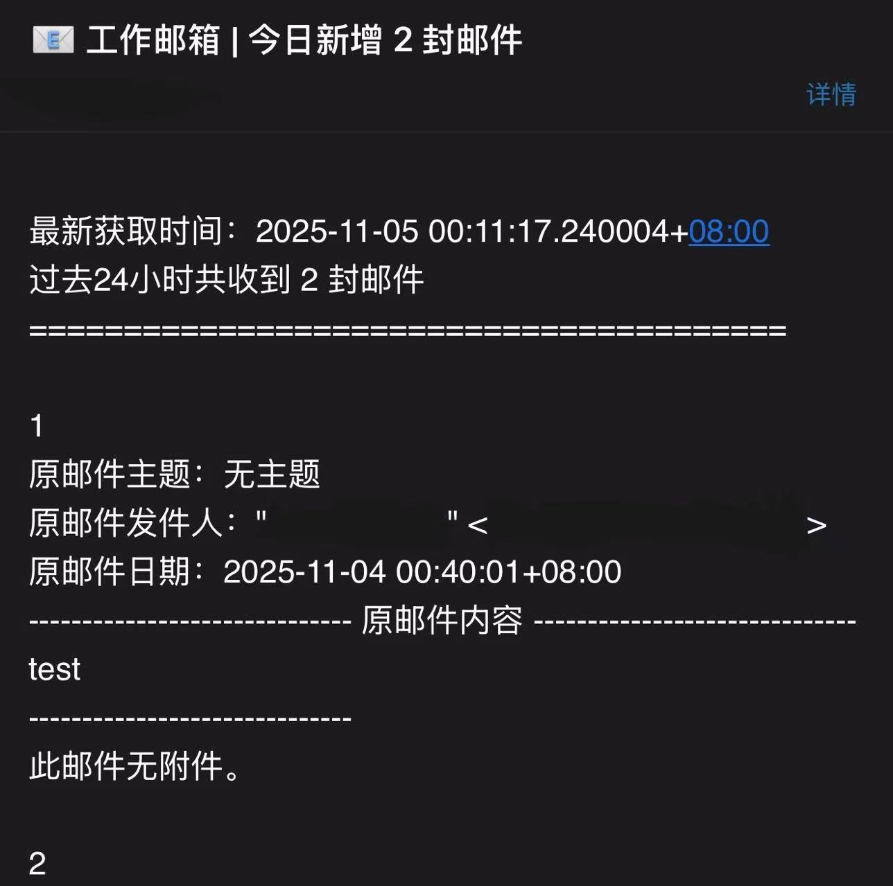

# DailyEmailForwarder  

## 我懒得看介绍了  

核心代码57行，也别看了，写得好像很高级的样子我都心虚。

[我该怎么用？](#我该怎么用)  

效果示例：

## 这是什么？
每日扒取不常用邮箱的邮件，汇总成一封邮件，发送到常用或者易于提醒的邮箱。  

如果您：  
· 不喜欢经常登很多邮箱  
· 很容易忘记登  
· 不容易收到提醒  
· 又害怕错过重要邮件  

这个或许能帮到您。  

## 有什么特点？  

### 整体上：
1. 代码简单，思路简单，逻辑简单
2. **zmail+smtp**，结合zmail解析邮件准确的优势和smtp发邮件的稳定  
   *imap配置更灵活，时间范围选取更简洁，但信息解码相当麻烦（至今不知道发件人怎么解出来）。在这方面处理上zmail更简洁。  
   zmail在发邮件上不太稳定，smtp靠谱点。*
3. 遍历时间范围内所有邮件，尽最大可能不错漏

### 细节上：
1. 比较日期时增加时区，更准确
2. 完整的文本正文（无正文也会告知），并判断是否有附件
3. 发送时发送者为被扒取的邮箱，逻辑更合理
4. 发送完后`server.close()`，避免错误报错
5. emmm……按自己理解搓的代码格式也算？

## 我该怎么用？  

### 准备
1. python （版本应该均可，个人3.12）
2. 安装`zmail`和`pytz` (终端`pip install`)
3. 想扒取的邮箱支持imap、smtp等协议，开启服务并获得授权码（有些叫客户端专用密码）、smtp服务器地址及SSL端口  

### 使用
1. 下载`DailyEmailForwarder.py`
2. 改参数  
   **最重要的是：被扒取的邮箱的地址、授权码、smtp服务器地址及SSL端口；收邮件的邮箱的地址（第8、第70-73、第84行）**  
   *时区、时间范围、变量命名、正文格式什么的自己按需求改即可。*
3. 设置自动化运行  

#### 如何设置自动化？
1. `Win+R`，输入`taskschd.msc`，打开任务计划程序。
2. 点击创建任务，依次设置过去：  
   **常规**：名称和描述，自己写。  
   **触发器**：设置触发时间，比如我设置了每天23点。  
   *最好选择一个电脑基本会开的时间，除非在条件里勾”唤醒计算机运行此任务“，虽然不太建议。*  
   **操作**：  
        **程序或脚本：python的位置**  
        添加参数：脚本位置  
        起始于：脚本所在的文件夹的位置  
   **条件和设置**：自己看着改。

## 特别感谢  
1. [Python邮箱连接与读取全指南_python读取邮件-CSDN博客](https://blog.csdn.net/2402_86120691/article/details/151249571)  
   *这份教程主要教读取邮件。*  
2. D老师(DeepSeek)

## 什么，你还想看？
一节水课（嘘）抄完两份get latest email的简易版本，一份是zmail，一份是imaplib+smtplib。而修缮成这版用了三天。从一开始直接抄代码，再到改到现在，几乎像原创了。  
 
对我而言确实有这方面需求。我自己本身邮箱就用得不多，那个邮箱更是只能电脑登，就老忘。之前试过很久没登，有天突然想起来后非常惶恐地登录，当时真的非常害怕自己错过了什么。  

其实想完善也可以继续，比如解析邮件真的出错了怎么办，比如因此邮件数和邮件内容不一致怎么办。但一方面我懒了（被打），另一方面这种概率确实有点小，所以就没有打补丁。 

最终搓出来的小脚本是傻瓜式的。逻辑其实就只有一点循环和一点判断，判断过程也相当暴力，代码更是能懒就懒。当然我相信写法是多样的，肯定有比这更完善更简洁的写法，**欢迎建议和修正，也欢迎提出疑问，我会尽力解释我的想法**。  

脚本很小，92行代码，57行核心代码。毕竟是第一次自学着做，也确实很费神，尤其是从获取最新一封改成一天汇总的时候，为此废了两三版，不断妥协，才磨出现在这个版本。  

所以最终能运行，每天手机能收到提醒，已经很开心了。  

2025.11.5