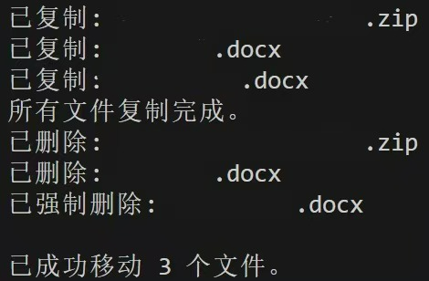

# FileMover  

## 我懒得看介绍了  

核心代码34行，更别看了，我非常心虚。

[我该怎么用？](#我该怎么用)  

效果示例：  

## 这是什么？  
将文件夹下的所有文件（**不包括子文件夹**）统一清理到一个指定的文件夹。    

如果您：  
· 微信等应用的下载文件夹装着很多没用甚至与本地重复的文件  
· 不想手动搬运  
· 又害怕扫射了以后可能有用的文件  

这个或许能帮到您。  

如果您：  
· 只想复制文件  
· 只想删除文件  

这个的一半也或许能帮到您。  

## 有什么特点？  

### 整体上：
1. 代码简单，思路简单，逻辑简单
2. **部分使用管理员权限**，解决因只读而无法搬运（主要是无法删除）的问题  
   *有相当一部分文件在下载的时候是只读模式。*  
3. 结果可视化程度高，可自主对文件做出最终操作
   *这是和腾讯管家等的文件清理相比的优势。可以到目标文件夹里对文件进行最终想要的操作（查看、筛选等），而不是对着打不开也很难看到路径的文件猜半天要清理还是移动。*

### 细节上：
1. 可兼容不同系统，更通用  
   *但某位懒人只测试过Windows系统的，其他系统尚未测试。*
2. 使用`.copy2()`，保留元数据  
3. 不搬运子文件夹，使目标文件夹里一目了然  

## 我该怎么用？  

### 准备
1. python （版本应该均可，个人3.12）
2. 源文件夹和目标文件夹的绝对路径  
   *源文件夹的路径一种方式在应用设置看，另一种右键一个下载过的文件，“在文件夹里显示”，然后回退到合适的位置。*  
   *没有测试过相对路径，因为个人觉得这两个绝对路径都非常好找。欢迎测评与反馈。*  
3. 足够的存储空间

### 使用
1. 下载`FileMover.py`
2. 改参数  
   **最重要的是：设置源文件夹和目标文件夹（第59行）。一定记得把“\”改为“/”。**  
   *可选：处理文件重名（第18-27行）。一般下载文件夹都已经处理过此问题，所以写成了注释。*  
   *变量命名、输出格式什么的自己按需求改即可。*
3. 运行  

## 特别感谢  
1. D老师(DeepSeek)  

## 什么，你还想看？
这是第二次还是第三次尝试。  

之前知道有只读引发的权限等问题，但当时想着改掉文件只读，然后成功搞死了，最后删掉了整个微项目。  

昨天睡前想找点事做，于是再从头开始试了一次。这次依旧是D老师出品，我唯一的贡献在于要求写开权限，以及把`move`拆成了`copy`+`delete`，没想到真能跑了XD，全程只用了一个小时。D老师写得也相当精简，所以我今天回看了后也没大调。  
 
用过微信的估计都知道微信下载文件所用的文件夹里都有些什么。上传了文件，想点开来欣赏一下，马上先下到这个文件夹；下载文件，首先下载到这个文件夹，后续点击下载到别的位置或者复制，这里的文件也不会消失，除非勤奋地找到这个文件位置进行剪切。所以这个文件夹里很多的文件其实没用——真有用的话为什么还不在本地更为常用的文件夹呢。  
（为什么不直接删，因为是怕真的有些有用的夹在里面。）  

没有设置自动化，比如一有新文件就转移。本来想做的，但主要是就在前几天，微信更新功能，可以直接指定下载到的位置，也就是可以绕开下载文件夹了。所以这个脚本的主要作用就是一次性清理封建残余。  

也没有再进行过多的情况考虑与优化，因为这个运行从开始到结束也就几秒钟的事情，要在这里面出什么岔子那还真是彩票中奖了。当然依旧**欢迎建议和修正，也欢迎提出疑问，我会尽力解释我的想法**。  

脚本比上次还小，仅34行核心代码。步骤无非就是两步：复制→删除。（根据我的猜测，写`.move()`其实实际运行也是这两步，因为测试的时候，目标文件夹有文件但源文件夹的文件并没有消失。）别看四个库，除了`shutil`是主力外，其他三个都只干了一两行：`path`定位位置，`os`判定系统，`subprocess`开下命令行。看着挺浪费，但没了又真不行。以及这是一次性脚本，用完了不想要了删了即可。  

如果想留着纪念也行，我会很开心的。  

2025.11.15  